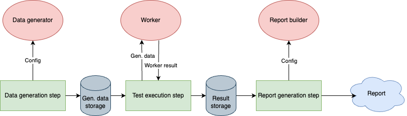

# statistic-test

This is a test framework for goodness-of-fit statistic tests.

## Architecture

Framework consists of 5 modules

1. Core module - provides distributions, cdf, pdf etc.
2. Persistence module - provides different stores to store data.
3. Experiment module - provides pipeline for experiment and default components for pipeline.
4. Expert system module - provides expert system for goodness-of-fit testing.
5. Tests module - provides different goodness-of-fit tests.

### Experiment architecture

## Default components

### Generators

### Storages

### Workers

PowerCalculationWorker - calculates goodness-of-fit test power

### Report builders

## Goodness-of-fit tests

### Weibull distribution

| №  | Test                       | Status       |
|----|----------------------------|--------------|
| 1  | Anderson–Darling           | Done         |
| 2  | Chi square                 | Done         |
| 3  | Kolmogorov–Smirnov         | Done         |
| 3  | Lilliefors                 | Done         |
| 4  | Cramér–von Mises           | Done         |
| 4  | Min-Toshiyuki              | Done         |
| 5  | Smith and Brian            | Content Cell |
| 5  | Ozturk and Korukoglu       | Done         |
| 6  | Tiku-Singh                 | Done         |
| 7  | Lockhart-O'Reilly-Stephens | Done         |
| 8  | Mann-Scheuer-Fertig        | Done         |
| 9  | Evans, Johnson and Green   | Content Cell |
| 10 | Skewness                   | Content Cell |
| 11 | Kurtosis                   | Content Cell |

### Exponential distribution

| Test                 | Second Header |
|----------------------|---------------|
| Ozturk and Korukoglu | Content Cell  |
| Jackson              | Content Cell  |
| Lewis                | Content Cell  |

### Normal distribution

| Test               | Second Header |
|--------------------|---------------|
| Anderson–Darling   | Content Cell  |
| Kolmogorov–Smirnov | Content Cell  |
| Chi square         | Content Cell  |
| skewness           | Content Cell  |
| kurtosis           | Content Cell  |

## Configuration

### Configuration example